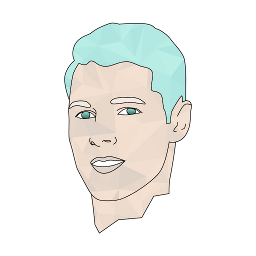

# 欢迎使用阿拉贡维基百科（Aragon Wiki）

> 阿拉贡（西班牙语：Aragón、加泰罗尼亚语：Aragó）是西班牙东北部的一个**自治区**，面积47,719平方公里，人口1,277,471（2003年）

**我们坚信 [去中心化组织可以解决世间棘手的问题](https://blog.aragon.org/decentralized-organizations-can-solve-the-worlds-worst-problems-840db6255d12)，这就是我们建立阿拉贡的初衷。**

本维基百科涵盖了大量对外开放项目相关资源。

如果您有意做出贡献如增改内容、提出错误已经其他反馈，敬请创建[Issues](https://github.com/aragon/aragon-wiki/issues) 并提交[Pull Request](https://github.com/aragon/aragon-wiki/pulls)

访问官网[aragon.org](https://aragon.org)获取更多信息。

## **内容速览**

更多分类信息点击左侧导航菜单查看，如下是核心内容说明：

- **<u>文档</u>**

    - 项目相关文档及白皮书等
    - 开发者资源
    - [阿拉贡治理提案](https://github.com/aragon/governance/issues)最终版本文档
    - 阿拉贡多重签名架构及钱包

- **<u>开发</u>**

    - 阿拉贡软件相关技术文档

- **<u>设计</u>**

    - 阿拉贡项目可视化资源
    - 应用UI、品牌、标识、商品等

- **<u>会议纪要</u>**

    - 开放会议相关文档和纪要

- **<u>职位</u>**

    - 关于阿拉贡的文化、工作环境以及申请相关职务等详情
    - 当前开放职位

- **<u>博客</u>**

    - 所有博客文章目录及链接

- **<u>视频</u>**

    - 所有视频链接

- **<u>媒体</u>**

    - 媒体资源
    - 媒体报道
    - 联络资料

- **<u>归档</u>**

    - 用于归档陈旧、过时的文件及资料

___

## 阿拉贡定义

<h4 style="color:#00CBE6;">民主共治</h4>

**迈向更加公平高效的社会**

> 我们建立阿拉贡是因为我们坚信 [去中心化组织可以解决大多世间棘手的问题](https://blog.aragon.org/decentralized-organizations-can-solve-the-worlds-worst-problems-840db6255d12).

阿拉贡是一个旨在通过区块链技术来组织、创建和维护去中介化组织的一个项目。我们希望让世界各地的人们能够轻松、安全地管理他们的组织。我们为每个人提供了管理自己的组织，掌控自己生活的工具。

通过让世界上的每一个人都能有效组织协同起来，我们正在创造一种无国界、无需许可、更高效的价值创造方式。

<h4 style="color:#00CBE6;">消灭中介</h4>
**回归独立自主**

> 阿拉贡创建的组织由以太坊(Ethereum)提供支持，Ethereum是一个用于持续运行应用程序的公共区块链。在Ethereum中，代码和应用程序总是在不停机或检查的情况下运行。

Blockchain technology provides a single shared source of cryptographically verified truth. This is secured by a network made up of thousands of computers all over the globe. Anyone can set up their own node where all the necessary data is replicated across the network.
区块链技术提供了一个经过加密验证的事实的共享源。这是由全球数千台计算机组成的网络所保证的。任何人都可以设置自己的节点，所有必要的数据都可以在其中跨网络复制。

This decentralized design ensures a borderless and permissionless way of operating, without the fear of a government or a malicious third-party interfering.
这种分散的设计确保了一种无边界和无许可的运作方式，而不用担心政府或恶意第三方的干预。

<h4 style="color:#00CBE6;">一个没有土地和边界的自治体</h4>

**数字管辖**

> Aragon Network will be the first community governed decentralized organization whose goal is to act as a digital jurisdiction, an online decentralized court system that isn’t bound by traditional artificial barriers such as national jurisdictions or the borders of a single country.

Aragon organizations can be upgraded seamlessly using our aragonOS architecture. They can solve disputes between two parties by using the decentralized court system, a digital jurisdiction that operates only online and utilizes your peers to resolve issues.

The Aragon Network Token, ANT, puts the power into the hands of the people participating in the operation of the Network. Every single aspect of the Network will be governed by those willing to make an effort for a better future.

### **客户端**

<h2>使用去中心化方式运作您的组织</h2>

<h4 style="color:#00CBE6;">转账交易</h4>
**Tokens代表你在组织中的权益**

Your organization is in control of its funds. Transfer and assign them according to your personal needs without artificial limitations.

<h4 style="color:#00CBE6;">筹款</h4>
**Grasp the potential of a new form of crowdfunding**

Utilize the power of the crowd for funding and raise funds globally, in private or publicly, without relying on banks or financial gatekeepers.

<h4 style="color:#00CBE6;">投票</h4>
**Decision-making by voting**

Use voting for more effective results. Votes are a secure, transparent and unforgeable way to come to a decision on major issues.

<h4 style="color:#00CBE6;">支付</h4>
**Instant payments in a few clicks**

Adding a new employee to your organization and payroll is as easy as creating a new recurring payment.

<h4 style="color:#00CBE6;">账户</h4>
**Tamper-proof, effective accounting**

> Every transaction is recorded and can be verified on the blockchain at any given time

Unprecedented level of transparency can be gained through the use of a public blockchain to engrave every entry permanently on the ledger.

Pre-established rules can automatically define your quarterly spending and budgeting.

<h4 style="color:#00CBE6;">权限</h4>
**Flexible and resilient privilege escalation**

> Fine-grained permissions deliver the freedom to create an organization that will work for you.

Permissions can be granular and assigned in fine detail. You can choose to give people a certain degree of control over the organization and privileges can be escalated easily through a voting or different mechanisms if the person isn't allowed to directly perform a desired action.

By assigning different permissions to people, you can create the kind of organizational structure that is best suited for your needs.

### **阿拉贡网络**

<h2>Ensuring the success of decentralized organizations</h2>
<h2>确保去中心化组织的成果</h2>

**将权力交回到用户手上**

> The Aragon Network will decentralize its governance by gradually handing over control of the project to its users.

The Aragon Network will establish additional services for the organizations taking advantage of what Aragon provides.

Our mission is to make the Aragon Network an autonomous organization itself, which is managed by the people using it for their mutual prosperity.

<h4 style="color:#00CBE6;">ARAGON GOVERNANCE PROPOSALS</h4>
**[Join us in improving Aragon by making your voice heard](https://github.com/aragon/governance/issues)**

[Aragon Governance Proposals](https://github.com/aragon/governance/issues) is a system for community members to join the discussion and create proposals affecting Aragon.

Everyone is welcome to [join in and aid](https://github.com/aragon/governance/issues) in forging the future of how Aragon will shape out to be. Together we can build the exciting future we want to see.

### **Why Aragon?**

> Aragon was born to bring transparency and independent governance to the forefront of managing an organization. We want to give the users the freedom they deserve to run their lives.

Organizations like companies exist to create value for their owners and users. They use the resources available to them in order to provide services and to create products.

Their ability to do this efficiently is hindered by factors outside of their influence. By removing unnecessary intermediaries and third parties that impose artificial restrictions and unnecessarily complex regulations, we can modernize the way organizations are run.

<h4 style="color:#00CBE6;">愿景</h4>
**Evolution of the internet and blockchain technology are changing the ways we interact with each other**

We believe that the progression of modern technology solutions, such as the invention of the blockchain, are changing the incentives for people to interact with each other. We are building the tools for the next generation of organizations to take advantage of this revolution.

Experimenting with new governance models has been a very risky endeavour during previous iterations of society. Now, for the first time in human history, we can let a thousand new governance models emerge, all from the comfort of our laptops.

## 社区

Aragon Chat - [https://aragon.chat](https://aragon.chat)

Aragon Research Forum - [https://research.aragon.org](https://research.aragon.org)

Reddit - [https://www.reddit.com/r/aragonproject/](https://www.reddit.com/r/aragonproject/)

Twitter - [https://twitter.com/aragonproject](https://twitter.com/aragonproject)

LinkedIn - [https://www.linkedin.com/company/aragonproject/](https://www.linkedin.com/company/aragonproject/)

YouTube - [https://www.youtube.com/c/AragonProject](https://www.youtube.com/c/AragonProject)

## Teams

> _To encourage other teams to work on Aragon, we will be splitting off the Association to form a company of core developers. Everyone currently employed by the Association will become employees of a new company funded by the Association. That way, **we level the playing field for other teams to join the core development of the project**._

With [Aragon Nest](https://github.com/aragon/nest) we are already supporting projects that are not necessarily sustainable by themselves yet, but are crucial to the Aragon and Ethereum ecosystems.

**We will expand the scope of Nest to start funding alternative teams** that have a desire to work on the [**Aragon client**](https://hack.aragon.org/docs/getting-started.html), [**aragonOS**](https://hack.aragon.org/docs/aragonos-ref.html) and on [**Aragon Apps**](dev/apps/).

Since we released the first version of the [Aragon whitepaper](documentation/whitepaper.md), we knew that it was important to **split the non-profit entity** overseeing the project [**from the actual companies or teams working on its development**](https://blog.aragon.org/the-path-to-mainstream-decentralized-organizations-d95a89d3cac4).

For more context, we've published three blog posts about why it makes sense to [decentralize Aragon's development](https://blog.aragon.org/decentralizing-aragons-development-5062fd6d135d), [the steps forward for the non-profit entity](https://blog.aragon.org/decentralizing-aragons-development-ii-minimum-viable-foundation-8ec1f9a13ebc) and [onboarding new teams](https://blog.aragon.org/decentralizing-aragons-development-iii-onboarding-new-teams-32786cb805a5) along with [the Aragon Manifesto](https://blog.aragon.org/the-aragon-manifesto-4a21212eac03).

### Aragon One

> [Aragon One](http://blog.aragon.one/introducing-aragon-one-b14dd804c5ce/) is one of the development teams working on Aragon. [Aragon One](https://aragon.one/) is a company that encompasses the foundational team working on the [Aragon Project](https://aragon.org). The company is currently established in Switzerland, although we want it to function as a DAO as much as possible.

> We want Aragon One to be a small team, with high-bandwidth and trust between individuals. Keeping the team small will help us prevent many of the problems that arise when growing too much and too fast.

> Funding for the company will come in a form of a grant given by the project's non-profit entity, in similar terms to the ones that the entity will provide to future teams that will be working on the project as well.

- **CEO / Chief Executive Officer**: [Luis Cuende](https://twitter.com/licuende)

> Luis has been awarded as the best underage European programmer in 2011, is a [Forbes 30 Under 30](https://www.forbes.com/30-under-30-europe-2016/technology/#6662a3e4a4b3), a [MIT TR35](https://www.innovatorsunder35.com/the-list/luis-cuende/) and was an Advisor to the VP of the European Commission.

> He cofounded the blockchain startup [Stampery](https://stampery.com/). Prior to founding startups, he created the world's first Linux distribution with facelogin.

> Advisor to a few crypto projects that awake his curiosity.

- **CTO / Chief Technical Officer**: [Jorge Izquierdo](https://twitter.com/izqui9)

> Curious hacker, creator of multiple apps for iOS and macOS. Reached App Store's #2. Always tinkering with new tech. Named as a [2017 class of Thiel Fellows](https://www.businesswire.com/news/home/20170616005607/en).

> Already convinced about the decentralized future of the Internet, he has been building toy projects such as a [mesh network](https://github.com/izqui/net) or a small [blockchain implementation](https://github.com/izqui/blockchain) since 2014.
___
>

> - **Ecosystem development at Aragon One**: [María Gómez](https://twitter.com/MyPaoG)

&nbsp;

> 

> - **Communications at Aragon One**: [Tatu Kärki](https://twitter.com/smokyish)

&nbsp;

> 

> - **Researcher at Aragon One**: [Luke Duncan](https://twitter.com/lkngtn)

&nbsp;

> 

> - **Community at Aragon One**: [John Light](https://twitter.com/lightcoin)

&nbsp;

> 

> - **Design at Aragon One**: [Jouni Helminen](https://twitter.com/dharmaone)

&nbsp;

> 

> - **Operations at Aragon One**: [Alexa Weaver](https://twitter.com/alexa_rwr)

**<h2>Dev Team</h2>**

> 

> - **UI & Interaction Developer at Aragon One**: [Pierre Bertet](https://twitter.com/bpierre)

&nbsp;

> 

> - **Lead Developer at Aragon One**: [Brett Sun](https://twitter.com/sohkai)

&nbsp;

> 

> - **Solidity Engineer at Aragon One**: [Bingen Eguzkitza](https://twitter.com/bingentxu)

### Aragon DAC

> The Aragon Association and [Giveth](https://giveth.io) are proud to announce the launch of Aragon DAC, a [Decentralized Altruistic Community](https://medium.com/giveth/giveth-introduces-decentralized-altruistic-communities-dacs-d1155a79bdc4) on the Giveth platform that will work on building out core Aragon infrastructure from the end user's perspective.

> The second team that will be working on the Aragon stack is a community focused effort led by the [Giveth community](https://wiki.giveth.io/dac/mission/#giveth-is-a-decentralized-altruistic-community-dac-focused-on-using-blockchain-technology-for-good-to-make-the-world-a-better-place): the Aragon DAC will kick off with **two specific projects or 'Campaigns'**: one focusing purely on development, the other on experimentation with the Aragon stack. Experienced members of Giveth and Aragon One will help kickstart the Aragon DAC initiatives on a voluntary and part-time basis, with the clear goal of steering the DAC towards full independence.

> Funding for the community will come in a form of a grant given by the project's non-profit entity, in similar terms to the ones that the entity will provide to [Aragon One](#aragon-one) and future teams that will be working on the project as well.

#### The Development Campaign
The Development Campaign is staffed with full-time and part-time people that create and tackle issues in the full Aragon Stack and is managed in a semi-decentralized way, while collaborating heavily with the Aragon One team and the R&D Campaign. This Campaign is spearheaded by Quazia, Social Coding Circle Lead at Giveth

#### The Community R&D Campaign
The Community R&D Campaign will focus on helping end users (=non-developers) experiment with using the Aragon Stack. #Dogfooding is the name of the game! This team is stewarded by Griff Green, Giveth's Governance Circle Lead
___
> - **[Quazia](https://github.com/quazia), [Social Coding Circle](https://medium.com/giveth/what-is-social-coding-fa81feacfa32) Lead at Giveth**

Social Coding Circle Lead at Giveth, who's already very familiar with Aragon through his work on an open-source planning app ([which was awarded a Nest Grant](https://blog.aragon.org/aragon-nest-first-awarded-grants-29a2f3aa8d4a/))

&nbsp;

> - **[Griff Green](https://twitter.com/thegrifft), Governance Circle Lead at Giveth**

Giveth's Governance Circle Lead, who brings loads of community management experience to the table (see initiatives such as an [open block explorer](https://www.youtube.com/watch?v=CXtkv-HzEso&list=PL4Artm1rmCWE5qYEOTaaPRl4fD5ORXFty), [scaling](http://scalingnow.giveth.io/) and [governance](https://www.youtube.com/playlist?list=PL4Artm1rmCWGiXwPth2TK1oOC9jXoUtlK) of the Ethereum ecosystem)

&nbsp;

> - **[Kris Decoodt](https://medium.com/@krrisis), Communication Circle Lead at Giveth**

The Community R&D team will also keep you, the community, up-to-date on all progress of the Aragon DAC with the help of communication lead Kris Decoodt
