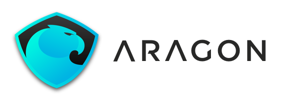
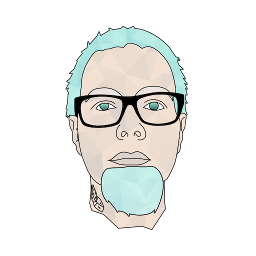

# 欢迎使用阿拉贡维基百科（Aragon Wiki）

> 阿拉贡（西班牙语：Aragón、加泰罗尼亚语：Aragó）是西班牙东北部的一个**自治区**，面积47,719平方公里，人口1,277,471（2003年）

**我们坚信 [去中心化组织可以解决世间棘手的问题](https://blog.aragon.org/decentralized-organizations-can-solve-the-worlds-worst-problems-840db6255d12)，这就是我们建立阿拉贡的初衷。**

本维基百科涵盖了大量对外开放项目相关资源。

如果您有意做出贡献如增改内容、提出错误已经其他反馈，敬请创建[Issues](https://github.com/aragon/aragon-wiki/issues) 并提交[Pull Request](https://github.com/aragon/aragon-wiki/pulls)

访问官网[aragon.org](https://aragon.org)获取更多信息。

## **内容速览**

更多分类信息点击左侧导航菜单查看，如下是核心内容说明：

- **<u>文档</u>**

    - 项目相关文档及白皮书等
    - 开发者资源
    - [阿拉贡治理提案](https://github.com/aragon/governance/issues)最终版本文档
    - 阿拉贡多重签名架构及钱包

- **<u>开发</u>**

    - 阿拉贡软件相关技术文档

- **<u>设计</u>**

    - 阿拉贡项目可视化资源
    - 应用UI、品牌、标识、商品等

- **<u>会议纪要</u>**

    - 开放会议相关文档和纪要

- **<u>职位</u>**

    - 关于阿拉贡的文化、工作环境以及申请相关职务等详情
    - 当前开放职位

- **<u>博客</u>**

    - 所有博客文章目录及链接

- **<u>视频</u>**

    - 所有视频链接

- **<u>媒体</u>**

    - 媒体资源
    - 媒体报道
    - 联络资料

- **<u>归档</u>**

    - 用于归档陈旧、过时的文件及资料

___

## 阿拉贡定义

<h3 style="color:#00CBE6;">民主共治</h3>

**迈向更加公平高效的社会**

> 我们建立阿拉贡是因为我们坚信 [去中心化组织可以解决大多世间棘手的问题](https://blog.aragon.org/decentralized-organizations-can-solve-the-worlds-worst-problems-840db6255d12).

阿拉贡是一个旨在通过区块链技术来组织、创建和维护去中介化组织的一个项目。我们希望让世界各地的人们能够轻松、安全地管理他们的组织。我们为每个人提供了管理自己的组织，掌控自己生活的工具。

通过让世界上的每一个人都能有效组织协同起来，我们正在创造一种无国界、无需许可、更高效的价值创造方式。

<h3 style="color:#00CBE6;">消灭中介</h3>

**回归独立自主**

> 阿拉贡创建的组织由以太坊(Ethereum)提供支持，Ethereum是一个用于持续运行应用程序的公共区块链。在Ethereum中，代码和应用程序总是在不停机或检查的情况下运行。

区块链技术提供了一个经过加密验证的等技术手段来达成共识。这是由全球数千台计算机组成的网络所保证的。任何人都可以设置自己的节点，所有必要的数据都可以在其中跨网络复制。

这种去中心化的设计确保了以无限扩展和无需中心机构许可就可以开展的运作方式，而不用担心政府或恶意第三方的干预。

<h3 style="color:#00CBE6;">民主自治</h3>

**数字管辖**

> 阿拉贡网络将是第一个完全由社区共同治理的去中心化组织，其目标是作为一个数字司法管辖区，一个在线去中心化的司法系统，不受任何国家司法管辖区或独立国家边界等传统人为障碍的约束。

阿拉贡组织可以使用我们的AragonOS基础架构进行无缝升级。他们可以通过使用去中心化司法系统来解决双方之间的争端，这是一种只在网上运作、利用你的网络节点来解决问题的数字司法系统。

阿拉贡网络通证（Aragon Network Token）ANT将权力交到网络运营管理者的手中。整个网络都将由那些愿意为更美好的未来而努力的人来管理。

### **核心功能**

<h3>使用去中心化方式运作您的组织</h3>

<h4 style="color:#00CBE6;">转账交易</h4>

**通证(Tokens)代表你在组织中的权益**

由阿拉贡管理的组织将通过其发行的通证进行管理，该通证可以根据您的个人需要进行转让和分配，不受人为的限制。

<h4 style="color:#00CBE6;">资金筹集</h4>

**挖掘新型众筹的潜力**

利用众筹在全球范围内以私募或公募的方式筹集资金，而不依赖银行或金融中介。

<h4 style="color:#00CBE6;">决策投票</h4>

**用投票做决策**

投票是就重大问题作出决定的一种安全、透明和不可篡改的方式，因此可以使用投票来获得更有效的决策结果。

<h4 style="color:#00CBE6;">转账支付</h4>

**简单快速完成支付**

向组织中添加新成员就像发起一笔支付一样简单。

<h4 style="color:#00CBE6;">财务会计</h4>

**高效、防篡改财务会计**

> 每笔交易都会按时间序列被记录，并且可以在区块链上进行验证

通过使用公有区块链在分类账上永久地记录所有交易，可以获得前所未有的透明度。

通过智能合约自动完成预先制定的规则如自动完成季度支出和预算。

<h4 style="color:#00CBE6;">权限管控</h4>

**灵活且富有弹性的权限逐步升级**

> 细粒度权限管理使得创建的组织更加灵活自由

权限可以按照较细的粒度进行设定和分配。可以选择赋予特定人选对组织一定程度的控制权，如果不允许某人直接执行所需的操作，那么也可以通过投票或其他机制轻松地进行权限赋予。

通过为人们分配不同的权限，创建最适合需求的组织结构。

### **阿拉贡网络**

<h4>去中心化组织的基石</h4>

**将权力交回到用户手上**

> 阿拉贡网络将通过逐步将项目控制权转移给更多的用户来达成去中心化治理。

阿拉贡网络将为基于阿拉贡构建的组织提供额外的服务。

我们的使命是使阿拉贡网络本身成为一个自治组织，由为共同繁荣的用户进行管理。

<h4 style="color:#00CBE6;">阿拉贡治理建议</h4>

**[加入我们，通过谏言一起来改善阿拉贡](https://github.com/aragon/governance/issues)**

[阿拉贡治理建议](https://github.com/aragon/governance/issues) 是一个让社区成员参与讨论并提出影响阿拉贡的建议系统。

欢迎大家[参与进来帮助](https://github.com/aragon/governance/issues)塑造阿拉贡的未来。激动人心的未来将有我们一起共同创造。

### **目标**

> 阿拉贡的诞生是为了将透明、独立的治理思想带到管理组织的前沿应用。我们想给用户应该拥有的自由来经营自己的生活。

像公司这样的组织存在的目的是为所有者和用户创造价值。他们使用可用的资源创建产品或提供服务。

但目前大多公司或组织往往受到其能力外因素的阻碍。我们尝试着通过消除人为限制、不必要的复杂规定、不必要的中介和第三方去颠覆组织运作方式，使其更加具备适应性。

### **愿景**

> **互联网和区块链技术的发展正在改变我们的协作方式**

我们相信，现代技术的进步，如区块链的发明，正在改变人们相互协作的方式。我们正在利用这场革命，为次世代组织（去中心化组织）构建工具。

在以前的社会演进中，尝试新的治理模型是一项极具风险的工作。但现在，随着网络及计算终端的普及，我们第一次可以上千种新的治理模型涌现，着这在人类历史上也是前所未见的。

## 社区

在线聊天室 Aragon Chat - [https://aragon.chat](https://aragon.chat)

论坛 Aragon Research Forum - [https://research.aragon.org](https://research.aragon.org)

Reddit - [https://www.reddit.com/r/aragonproject/](https://www.reddit.com/r/aragonproject/)

Twitter - [https://twitter.com/aragonproject](https://twitter.com/aragonproject)

LinkedIn - [https://www.linkedin.com/company/aragonproject/](https://www.linkedin.com/company/aragonproject/)

YouTube - [https://www.youtube.com/c/AragonProject](https://www.youtube.com/c/AragonProject)

## 团队

> _为了鼓励其他团队更好地在Aragon上参与协作，我们将从基金会中独立出一个由核心开发人员组成的公司。目前受雇于本基金会的每个人都将成为基金会资助的新公司的成员。这样就可以为其他团队加入到项目的核心开发中提供了公平的竞争环境_

通过[Aragon Nest](https://github.com/aragon/nest)，我们已经在支持一些项目，这些项目本身虽然不一定是可持续的，但对Aragon和Ethereum生态系统至关重要。

**我们将扩大Nest的支持范围**，为那些希望在[**Aragon客户端**](https://hack.aragon.org/docs/getting-started.html)、[**AragonOS**](https://hack.aragon.org/docs/aragonos-ref.html)和[**Aragon应用**](dev/apps/)上做出贡献的团队提供资金。

自从我们发布了[阿拉贡白皮书](documentation/whitepaper.md)的第一个版本以来，我们就知道将监督项目的非盈利实体与致力于[项目开发的实际公司或团队](https://blog.aragon.org/the-path-to-mainstream-decentralized-organizations-d95a89d3cac4)分离是非常重要的。

有关更多内容，可以参考我们已经发表的三篇博文，分别是[为什么阿拉贡采用去中心化开发是有意义的](https://blog.aragon.org/decentralizing-aragons-development-5062fd6d135d)，[非盈利实体的前进步骤](https://blog.aragon.org/decentralizing-aragons-development-ii-minimum-viable-foundation-8ec1f9a13ebc)以及[新团队的加入](https://blog.aragon.org/decentralizing-aragons-development-iii-onboarding-new-teams-32786cb805a5)以及[阿拉贡宣言](https://blog.aragon.org/the-aragon-manifesto-4a21212eac03)。

### Aragon One

> [Aragon One](http://blog.aragon.one/introducing-aragon-one-b14dd804c5ce/) is one of the development teams working on Aragon. [Aragon One](https://aragon.one/) is a company that encompasses the foundational team working on the [Aragon Project](https://aragon.org). The company is currently established in Switzerland, although we want it to function as a DAO as much as possible.

> We want Aragon One to be a small team, with high-bandwidth and trust between individuals. Keeping the team small will help us prevent many of the problems that arise when growing too much and too fast.

> Funding for the company will come in a form of a grant given by the project's non-profit entity, in similar terms to the ones that the entity will provide to future teams that will be working on the project as well.

- **CEO / 总裁**: [Luis Cuende](https://twitter.com/licuende)

> Luis has been awarded as the best underage European programmer in 2011, is a [Forbes 30 Under 30](https://www.forbes.com/30-under-30-europe-2016/technology/#6662a3e4a4b3), a [MIT TR35](https://www.innovatorsunder35.com/the-list/luis-cuende/) and was an Advisor to the VP of the European Commission.

> He cofounded the blockchain startup [Stampery](https://stampery.com/). Prior to founding startups, he created the world's first Linux distribution with facelogin.

> Advisor to a few crypto projects that awake his curiosity.

- **CTO / 技术总监**: [Jorge Izquierdo](https://twitter.com/izqui9)

> Curious hacker, creator of multiple apps for iOS and macOS. Reached App Store's #2. Always tinkering with new tech. Named as a [2017 class of Thiel Fellows](https://www.businesswire.com/news/home/20170616005607/en).

> Already convinced about the decentralized future of the Internet, he has been building toy projects such as a [mesh network](https://github.com/izqui/net) or a small [blockchain implementation](https://github.com/izqui/blockchain) since 2014.
___
>

> - **Ecosystem development at Aragon One**: [María Gómez](https://twitter.com/MyPaoG)

&nbsp;

> 

> - **Communications at Aragon One**: [Tatu Kärki](https://twitter.com/smokyish)

&nbsp;

> 

> - **Researcher at Aragon One**: [Luke Duncan](https://twitter.com/lkngtn)

&nbsp;

> 

> - **Community at Aragon One**: [John Light](https://twitter.com/lightcoin)

&nbsp;

> 

> - **Design at Aragon One**: [Jouni Helminen](https://twitter.com/dharmaone)

&nbsp;

> 

> - **Operations at Aragon One**: [Alexa Weaver](https://twitter.com/alexa_rwr)

**<h2>Dev Team</h2>**

> 

> - **UI & Interaction Developer at Aragon One**: [Pierre Bertet](https://twitter.com/bpierre)

&nbsp;

> 

> - **Lead Developer at Aragon One**: [Brett Sun](https://twitter.com/sohkai)

&nbsp;

> 

> - **Solidity Engineer at Aragon One**: [Bingen Eguzkitza](https://twitter.com/bingentxu)

### Aragon DAC

> The Aragon Association and [Giveth](https://giveth.io) are proud to announce the launch of Aragon DAC, a [Decentralized Altruistic Community](https://medium.com/giveth/giveth-introduces-decentralized-altruistic-communities-dacs-d1155a79bdc4) on the Giveth platform that will work on building out core Aragon infrastructure from the end user's perspective.

> The second team that will be working on the Aragon stack is a community focused effort led by the [Giveth community](https://wiki.giveth.io/dac/mission/#giveth-is-a-decentralized-altruistic-community-dac-focused-on-using-blockchain-technology-for-good-to-make-the-world-a-better-place): the Aragon DAC will kick off with **two specific projects or 'Campaigns'**: one focusing purely on development, the other on experimentation with the Aragon stack. Experienced members of Giveth and Aragon One will help kickstart the Aragon DAC initiatives on a voluntary and part-time basis, with the clear goal of steering the DAC towards full independence.

> Funding for the community will come in a form of a grant given by the project's non-profit entity, in similar terms to the ones that the entity will provide to [Aragon One](#aragon-one) and future teams that will be working on the project as well.

#### 开发活动
The Development Campaign is staffed with full-time and part-time people that create and tackle issues in the full Aragon Stack and is managed in a semi-decentralized way, while collaborating heavily with the Aragon One team and the R&D Campaign. This Campaign is spearheaded by Quazia, Social Coding Circle Lead at Giveth

开发活动由全职和兼职人员组成，他们在整个Aragon堆栈中创建和处理问题，并以局部去中心化的方式进行管理，同时与Aragon One团队和研发活动进行大量合作。这个活动由Quazia发起，并在社交编程圈子Giveth中比较突出。

#### 社区研发活动
The Community R&D Campaign will focus on helping end users (=non-developers) experiment with using the Aragon Stack. #Dogfooding is the name of the game! This team is stewarded by Griff Green, Giveth's Governance Circle Lead
___
> - **[Quazia](https://github.com/quazia), [Social Coding Circle](https://medium.com/giveth/what-is-social-coding-fa81feacfa32) Lead at Giveth**

Social Coding Circle Lead at Giveth, who's already very familiar with Aragon through his work on an open-source planning app ([which was awarded a Nest Grant](https://blog.aragon.org/aragon-nest-first-awarded-grants-29a2f3aa8d4a/))

&nbsp;

> - **[Griff Green](https://twitter.com/thegrifft), Governance Circle Lead at Giveth**

Giveth's Governance Circle Lead, who brings loads of community management experience to the table (see initiatives such as an [open block explorer](https://www.youtube.com/watch?v=CXtkv-HzEso&list=PL4Artm1rmCWE5qYEOTaaPRl4fD5ORXFty), [scaling](http://scalingnow.giveth.io/) and [governance](https://www.youtube.com/playlist?list=PL4Artm1rmCWGiXwPth2TK1oOC9jXoUtlK) of the Ethereum ecosystem)

&nbsp;

> - **[Kris Decoodt](https://medium.com/@krrisis), Communication Circle Lead at Giveth**

The Community R&D team will also keep you, the community, up-to-date on all progress of the Aragon DAC with the help of communication lead Kris Decoodt
